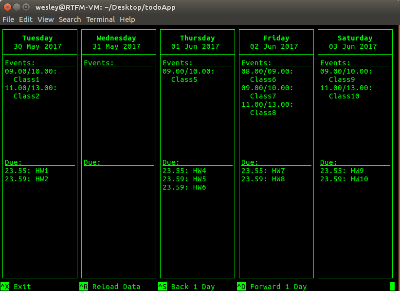

# todoApp

A very basic terminal app to display a schedule/todo list.  I made this because I couldn't find a program that would let me see my classes as well as the assignments I have do for that day in a format I liked.  This made with C and ncurses because C is generally amazing and terminal apps are cool.

<center></center>

## Building
Have some C complier (I used GCC) and ncurses installed.  To install the ncurses stuff on Ubuntu just install `ncurses-dev`.
To configure sources automatically jist run ```./configure.sh``` THIS IS HIGHLY RECOMMENDED VARIANT
If you want to configure sources manually run ```./configure --srcdir=<directory with src/ directory which (src/) contains source code> --bindir=<bindir>```
Then run ```make all``` to build todoApp, todoApp executable will be placed to the directory passed to configure script as value of ```bindir``` argument

## Usage
The built executable takes no arguments so just run it with `./todo <options>`.  Once it starts it will try to load `data.txt`.  This is where all of the data for the program is stored.  Since the program doesn't allow editing the file yet, you'll have to add events and stuff here manually.

Supported options are:
`-t <text color> or --text_color <text color>`
`-b <background color> or --background_color <background color>`

The program will display as many days as possible based on the width of the terminal window.  If you resize the window you might have to use `^R` to get it to redraw.  By default, each day has a width of 18, which means the usable space is 16 charecters.  To change this modify the `DAY_WIDTH` value in `todo.h`.

### Controls
- `^R`: Reload the data file use
- `^D`: Scroll the view to the right
- `^S`: Scroll the view to the left
- `^X`, `^C`, or `^Q` Exit the program

### Adding/Editing Events and Due Dates
There is a sample `data.txt` file in the repo, I tried to make the format easy to understand and edit, so hopefully, you can figure it out just by looking at it, but here's the format:

```T<YYYY-MM-DD>N: [line1];[line2];[line3]...```

- `T` is the type (E for event, D for due date)
- `YYYY` is the 4 character year (e.g. 2017)
- `MM` is the 2 character month (e.g. 05)
- `DD` is the 2 charater day of the month (e.g. 30)
- `[lineX]` is the line to display in the program, to display more than one line for and event or due date, separate each with a semicolon.  If you try to make a line longer than the useable day width (16 by default), it will wrap, but it'll overwrite the day border.
- `N` is the priority of the event. It is an optional field in event string. The range of N is from 0 to 3.
- Priorities and colors:
0 - cyan
1 - yellow
2 - mageta
3 - red
WARNING: There may be some problems with the colors. The background color and the text color can match in some combinations of the colors, so the text on the screen will be unreadable.


Each day in the `data.txt` can be spread out amoung other days if you wish (the program uses the date stamp on the line to decide what day to display it on in the program), although, the order for the events each day does matter since the program does not try to pull and times out of the line, it will display them in the order they are listed in the file for each day.  Hopefully that makes sense, if it doesn't, just shift some of the lines around and see what happens.

## Todo
I'd like to add all the stuff below, but as of right now, this is in a usable state for me, so I may or may not:

- Adding and removing events and things due
- Auto sorting the stuff for each day
- Colors
- Ability to load different calenders from within the app
- Config file to make this configurable without having to modify the source code
- Make terminal resizing better

### Dependencies

-libtool
-autotools (autoconf, automake)
